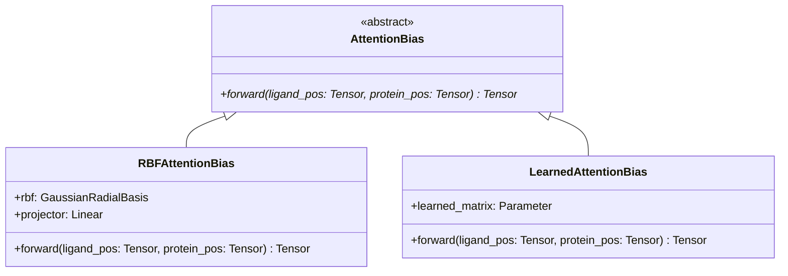

# Phase 3.1B Software Architecture (Revised)
**Experiment ID**: `P3.1B-GEOMETRY-ATTENTION`  
**Status**: Architecture Approved  

---

## 1. Abstraction Layers and Hierarchy

The attention bias subsystem follows the Open-Closed Principle (OCP) and Single Responsibility Principle (SRP). The core module is decoupled from the distance representation mapping through an abstract interface.

### 1.1 Class Hierarchy


### 1.2 Component Dependency Graph
```text
protliggnn_train.py
    │
    ▼
geometry_attention_model.py (contains ProtLigGNNGeometryAttention)
    │
    ├──► models/geometry_attention/attention_bias.py (defines RBFAttentionBias)
    │        │
    │        └──► models/geometry/radial_basis.py (reuses GaussianRadialBasis)
    │
    └──► models/geometry_attention/geometry_attention_utils.py (pairwise distances)
```

---

## 2. Configuration Flow & Serialization
All architectural variables are contained within a centralized config dataclass:

```python
from dataclasses import dataclass
from typing import Literal

@dataclass
class AttentionBiasConfig:
    bias_type: Literal["rbf", "learned"] = "rbf"
    num_rbf: int = 32
    cutoff_distance: float = 12.0
    learnable_scale: bool = True
    initial_alpha: float = 0.1
    normalize_bias: bool = True
    num_heads: int = 4
```

### Configuration Flow
1. CLI inputs inside `protliggnn_train.py` parse arguments and populate an `AttentionBiasConfig` instance.
2. The config instance is serialized into `config.json` inside the experiment run folder.
3. During checkpoint saving, the state of the config is serialized and stored alongside model weights in `checkpoint.pt`. This ensures 100% reproducible model recreation.

---

## 3. Extension Points (OCP Compliance)
To integrate future interaction modules without modifying the existing cross-attention code, developers only need to:
1. Inherit from `AttentionBias`.
2. Register the new class type in `AttentionBiasConfig`'s `bias_type` literals.
3. Instantiate the corresponding child class in `models/geometry_attention/attention_bias.py`'s factory method.

Examples of future extensions:
- **Fourier bias**: Maps coordinates using high-frequency sine/cosine positional encodings.
- **Physics-informed bias**: Uses Lennard-Jones ($12\text{--}6$) or Coulombic electrostatic potential formulas.
- **Orientation / SE(3) bias**: Computes orientation angles between residue normal vectors and ligand plane normals.
