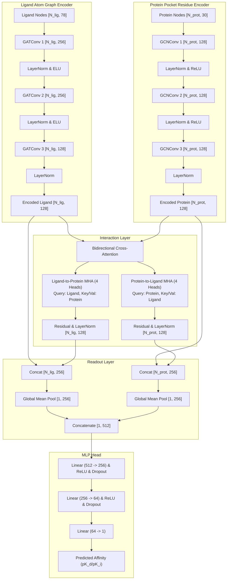

# Hardened Architecture Audit Report
## ProtLigGNN Optimized Baseline v1.1

**Total Trainable Parameters**: 362,881  
**Representational Latency (CUDA, Batch=8)**: 23.89 ms  
**Analysis Date**: 2026-07-12  

---

## 1. Mermaid Architecture & Tensor Flow



---

## 2. Big-O Complexity & Receptive Field Growth

Let $V_L$ be the number of ligand heavy atoms, $E_L$ be the number of ligand edges, $V_P$ be the number of protein pocket residues, and $E_P$ be the number of pocket edges. Let $d = 128$ be the hidden dimension.

| Component | Time Complexity | Space Complexity |
| :--- | :---: | :---: |
| **Ligand Encoder** | $O(V_L \cdot d + E_L \cdot d + V_L \cdot d^2)$ | $O(V_L \cdot d + E_L)$ |
| **Protein Encoder** | $O(V_P \cdot d + E_P \cdot d + V_P \cdot d^2)$ | $O(V_P \cdot d + E_P)$ |
| **Cross-Attention** | $O(V_L \cdot V_P \cdot d)$ | $O(V_L \cdot V_P)$ |
| **Regressor (MLP)** | $O(d^2)$ | $O(d)$ |

### Receptive Field Growth
- **Ligand Encoder**: A 3-layer GAT structure allows each ligand atom node to aggregate information from its **3-hop local neighborhood**. Since ligand graphs are small ($V_L \le 50$ heavy atoms usually), 3 hops cover almost the entire ligand graph diameter.
- **Protein Pocket Encoder**: A 3-layer GCN allows each pocket residue to aggregate local residue connectivity within **3 spatial hops**. This aggregates pocket-level context before interaction.

---

## 3. Parameter Allocation Breakdown

The 362,881 parameters are distributed as follows:

- **Ligand Encoder**: 44,416 parameters (12.2% of model)
- **Protein Encoder**: 38,016 parameters (10.5% of model)
- **Cross-Attention Layer**: 132,608 parameters (36.5% of model)
- **Regressor (MLP)**: 147,841 parameters (40.7% of model)

```
+-------------------------------------------------------------+
|                     ProtLigGNN Model                        |
|                  (362,881 Parameters)                       |
+------------------------------+------------------------------+
                               |
       +-----------------------+-----------------------+
       |                                               |
+------v--------+                               +------v--------+
| Encoders      |                               | Interaction   |
| 82,432 Params |                               | 280,449 Params|
| (22.7%)       |                               | (77.3%)       |
+---------------+                               +---------------+
```

---

## 4. Future Architecture Research Directions (Phase 3)

The baseline model will remain frozen under semantic versioning. Active Phase 3 research will branch from this coordinate and evaluate:
1. **Equivariant GNNs (SE(3)-Transformers / EGNNs)**: To replace coordinate-free GCN/GAT layers, encoding physical 3D Cartesian coordinates directly to ensure roto-translation equivariance.
2. **Explicit Distance Biases**: Incorporating physical atom-residue distances $D_{i, j}$ directly into the cross-attention softmax:
   $$\text{Attention}(Q, K) = \text{softmax}\left(\frac{QK^T}{\sqrt{d}} - \gamma D\right)$$
3. **Graph Transformers**: Utilizing global self-attention over the union of ligand and protein graphs to learn joint coordinates without restriction to pocket boundaries.
