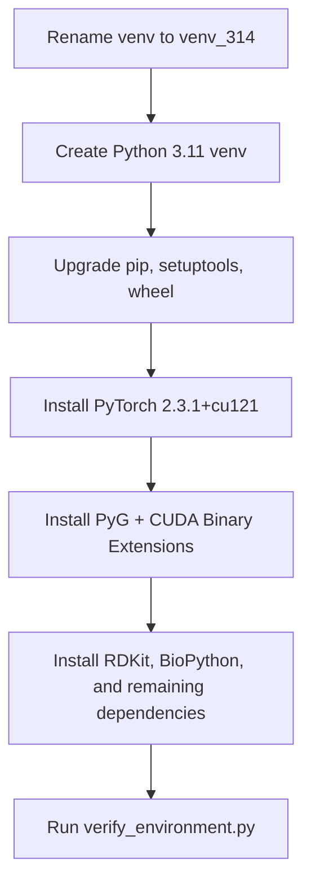

# Environment Migration Plan

This document outlines the step-by-step plan to transition the ProtLigGNN repository from a CPU-only Python 3.14 environment to a CUDA-enabled Python 3.11.9 research environment.

---

## Migration Architecture

### 1. Current State
- **Interpreter:** Python 3.14.3
- **Virtual Environment:** `d:\ProtLigGnn\venv` (CPU fallback)
- **PyTorch:** 2.13.0+cpu
- **GPU Usage:** 0% (unusable due to Python 3.14 package constraints)

### 2. Target State
- **Interpreter:** Python 3.11.9 (installed via winget at `C:\Users\Harshhhh\AppData\Local\Programs\Python\Python311`)
- **Virtual Environment:** `d:\ProtLigGnn\venv` (CUDA-enabled)
- **PyTorch:** 2.3.1+cu121
- **PyG:** 2.5.3 (with `torch-scatter`, `torch-sparse`, `torch-cluster`, `torch-spline-conv` precompiled binary extensions)
- **GPU Usage:** Fully operational CUDA graph training and inference.

---

## Migration Steps



### Step 1: Backup Current Virtual Environment
We will rename the current virtual environment folder to preserve a fallback option:
- Rename `d:\ProtLigGnn\venv` to `d:\ProtLigGnn\venv_314`.

### Step 2: Create Python 3.11.9 Virtual Environment
We will create a fresh virtual environment using the newly installed Python 3.11:
```bash
C:\Users\Harshhhh\AppData\Local\Programs\Python\Python311\python.exe -m venv d:\ProtLigGnn\venv
```

### Step 3: Upgrade Package Installer Tools
```bash
.\venv\Scripts\python -m pip install --upgrade pip setuptools wheel
```

### Step 4: Install CUDA-enabled PyTorch
We will pull the exact CUDA 12.1-enabled wheels:
```bash
.\venv\Scripts\pip install torch==2.3.1 torchvision==0.18.1 torchaudio==2.3.1 --index-url https://download.pytorch.org/whl/cu121
```

### Step 5: Install PyTorch Geometric and Binary Extensions
Using the validated index for `torch-2.3.1+cu121`:
```bash
.\venv\Scripts\pip install torch-scatter torch-sparse torch-cluster torch-spline-conv torch-geometric -f https://data.pyg.org/whl/torch-2.3.1+cu121.html
```

### Step 6: Install Scientific & Biology Libraries
We will freeze NumPy at `1.26.4` to avoid compatibility breaks with PyTorch/PyG under NumPy 2.x:
```bash
.\venv\Scripts\pip install numpy==1.26.4 scipy pandas scikit-learn matplotlib biopython rdkit pyyaml pytest tqdm
```

### Step 7: Run Environment Validation
We will run `verify_environment.py` to confirm CUDA tensor allocation, GPU memory access, and PyG operation correctness.

---

## Rollback Strategy

If any step fails, or if PyTorch Geometric binary extensions fail to bind to CUDA:
1. Delete the new `d:\ProtLigGnn\venv` folder.
2. Rename `d:\ProtLigGnn\venv_314` back to `d:\ProtLigGnn\venv`.
3. The system is immediately restored to the functional CPU-only Python 3.14 state.

---

## Risk Assessment & Mitigations

### 1. NumPy 2.x Binary Incompatibility
- **Risk:** Installing packages like `scipy` or `pandas` might pull NumPy 2.x, which is binary-incompatible with PyTorch 2.3.1 and will cause C-extension segfaults.
- **Mitigation:** Explicitly install `numpy==1.26.4` before installing any other scientific packages, ensuring version constraints are strictly obeyed.

### 2. Low System Disk Space or Timeout
- **Risk:** PyTorch CUDA wheels are large (~2.7 GB), which can time out on poor connections or run out of disk space.
- **Mitigation:** Run the download/install commands sequentially with high timeout limits.
