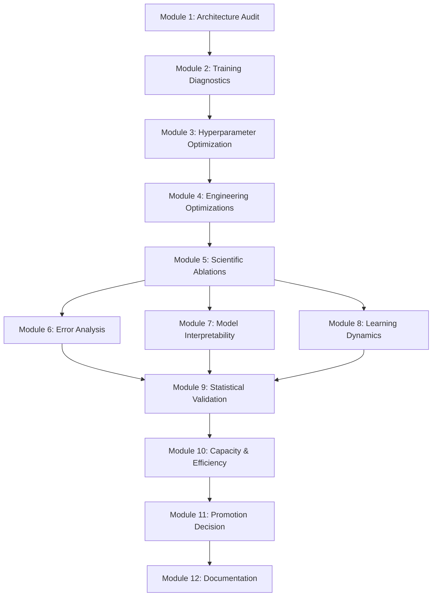

# Phase 2.9 — Baseline Optimization, Ablation & Scientific Validation Implementation Plan v2.0

**Document Version:** v2.0  
**Status:** Under Review (Pending User Approval)  
**Lead Research Scientist & ML Architect:** Antigravity AI  

---

## 1. Executive Summary

This document specifies the revised implementation plan for Phase 2.9 (Baseline Optimization, Ablation & Scientific Validation) of the ProtLigGNN repository. The primary objective is to maximize the performance of the existing ProtLigGNN GNN architecture on the local subset of the PDBbind v2020 General Set, without changing the scientific hypothesis, dataset splits, or feature definitions. 

By defining rigorous experimental protocols, utilizing Bayesian optimization (Optuna), separating engineering optimizations from scientific ablations, and applying strict statistical tests, we ensure that the resulting baseline is scientifically defensible, statistically verified, and fully reproducible.

---

## 2. Objectives

1. **Optimize Existing Architecture Capacity**: Locate the optimal hyperparameters (learning rate, weight decay, dropout, hidden dimension) using Bayesian search.
2. **Isolate Engineering vs. Scientific Effects**: Disentangle hyperparameter tuning/optimizations (AdamW, learning rate schedulers, gradient clipping) from architectural ablations (cross-attention, LayerNorm, residuals).
3. **Establish Rigorous Statistical Signifcance**: Determine if any optimized model statistically outperforms the frozen baseline ($p < 0.05$ via paired t-test, confidence intervals, and Cohen's $d$ effect size).
4. **Quantify Compute & Model Capacity**: Audit parameter count, memory footprint, throughput, and training dynamics to characterize the baseline's efficiency.
5. **Identify Systemic Failure Modes**: Perform an expanded post-prediction error analysis on physical/graph properties (affinity range, graph size, ligand/protein sizes) to find systematic model weaknesses.

---

## 3. Assumptions & Constraints

- **Dataset Lock**: The dataset remains locked to the 1,000 PDBbind complexes defined in the Validated Baseline v0.95.
- **Split Lock**: Splits are fixed to the deterministic random train/val/test splits generated under seed `42` in [experiments/run_037/split](file:///d:/ProtLigGnn/experiments/run_037/split) (val_fraction=0.1, test_fraction=0.1).
- **Metric Lock**: The primary evaluation metric is validation/test Root Mean Squared Error (RMSE). Secondary metrics are MAE, Pearson ($r$), Spearman ($\rho$), and $R^2$.
- **Graph Pipeline Lock**: Graph node and edge features, pocket radius ($6.0\text{ \AA}$), and edge thresholds ($8.0\text{ \AA}$) are completely frozen.
- **Environment Lock**: Executions must run inside the official `ProtLigGNN Environment v1.0` using PyTorch `2.3.1+cu121` on the target NVIDIA GPU.

---

## 4. Experimental Methodology

### 4.1 Study Tracking & Isolation
- Every experiment run must be registered in the central [experiments/registry.csv](file:///d:/ProtLigGnn/experiments/registry.csv).
- To preserve the frozen baseline, the candidate optimized baseline runs will be grouped under their own unique experiment IDs (e.g., `run_042` to `run_046`).
- Optuna studies will be stored locally as a serialized SQLite database (`experiments/optuna_study.db`) to enable tracking, continuation, and plotting.

### 4.2 Statistical Significance Protocol
Any optimized model candidate will be compared against the frozen baseline ($5$ seeds: `[42, 123, 777, 2024, 3407]`) using:
1. **Paired Two-Sample t-test**: Over the test RMSE values of the 5 seeds ($p < 0.05$).
2. **Bootstrap 95% Confidence Intervals**: Generated over 1,000 bootstrap resamples on the pooled test predictions.
3. **Effect Size (Cohen's $d$)**:
   \[
   d = \frac{\bar{X}_1 - \bar{X}_2}{s_p}
   \]
   Where $s_p$ is the pooled standard deviation across the 5 runs.

---

## 5. Detailed Modules

### Module 1: Architecture Audit
- **Goal**: Formally inspect parameter flow, LayerNorm positioning, activation functions, and layer sizing.
- **Implementation**:
  - Audit parameter counts per encoder (Ligand vs Protein) and regressor.
  - Assess gradient flow using PyTorch hooks to detect vanishing/exploding gradients.
  - **Deliverable**: `ARCHITECTURE_AUDIT.md` (ranking potential bottlenecks and improvements).

### Module 2: Training Diagnostics
- **Goal**: Evaluate baseline learning behavior (learning rate sensitivity, gradient norms, activation distributions).
- **Implementation**:
  - Run diagnostic trials to log training/validation loss curves on seed 42.
  - Measure the mean and variance of gradients across epochs.
  - **Deliverable**: Sections in `TRAINING_OPTIMIZATION_REPORT.md`.

### Module 3: Hyperparameter Optimization
- **Goal**: Perform a Bayesian optimization search using Optuna over a fixed budget.
- **Search Space**:
  - Learning Rate: Log-uniform $[10^{-4}, 3 \times 10^{-3}]$
  - Weight Decay: Log-uniform $[10^{-6}, 10^{-3}]$
  - Dropout: Uniform $[0.0, 0.4]$
  - Hidden Dimension: Choice $\{128, 256, 512\}$
- **Budget**: $50$ trials, optimizing validation RMSE.
- **Resumability**: Optuna trials will use an SQLite backend database (`experiments/optuna_study.db`).
- **Deliverable**: `HYPERPARAMETER_STUDY.md` (containing study parameters, parallel coordinate plots, and parameter importance plots).

### Module 4: Engineering Optimizations
- **Goal**: Evaluate performance gains from training tricks without modifying the GNN architecture.
- **Optimization Candidates**:
  - **Optimizers**: AdamW vs. RAdam vs. baseline Adam.
  - **Schedulers**: Cosine Annealing, ReduceLROnPlateau, and OneCycleLR.
  - **Gradient Clipping**: Grad norm thresholds of $\{1.0, 5.0, 10.0\}$.
  - **Warmup**: Linear warmup for the first $3$ epochs.
- **Deliverable**: `TRAINING_OPTIMIZATION_REPORT.md` (tabulating RMSE/MAE gains for each technique).

### Module 5: Scientific Ablation Studies
- **Goal**: Quantify the independent contribution of each architectural component.
- **Ablation Matrix** (varying one factor at a time):
  1. **No Crossgraph**: Bypassing Bidirectional Cross-Attention (replacing with zero-padded identity mapping).
  2. **No Attention**: Bypassing the MultiheadAttention layer, using plain global mean pooling of GNN outputs.
  3. **No LayerNorm**: Disabling all `LayerNorm` layers in the Encoders and Cross-Attention module.
  4. **No Residual**: Disabling residual connections inside `BidirectionalCrossAttention`.
  5. **Pooling Strategy**: Comparing Global Mean Pooling vs. Global Max Pooling.
- **Deliverable**: `ABLATION_STUDY.md` (tabulating validation and test metrics for each ablated candidate).

### Module 6: Error Analysis
- **Goal**: Expand prediction error audit to identify systematic model failures.
- **Analysis Variables**:
  - Correlation between prediction error (residuals) and true affinity range ($[0.0, 15.0]$).
  - Residuals vs. ligand size (number of heavy atoms).
  - Residuals vs. protein size (number of pocket residues).
  - Outlier identification (complexes with residuals $> 3.0$ RMSE).
- **Deliverable**: `ERROR_ANALYSIS_REPORT.md` (including scatter plots, residual distributions, and physical pocket analysis of failed cases).

### Module 7: Model Interpretability
- **Goal**: Extract attention weights and saliency maps to identify binding determinants.
- **Implementation**:
  - Extract attention maps from `BidirectionalCrossAttention` MultiheadAttention layers for 3 best-predicted and 3 worst-predicted complexes.
  - Compute gradient-based input saliency maps for protein pocket residues to identify key binding nodes.
  - **Deliverable**: `MODEL_INTERPRETABILITY_REPORT.md` (visualizing cross-attention weight distributions over target pocket residues).

### Module 8: Learning Dynamics
- **Goal**: Evaluate convergence speed and generalization gap.
- **Implementation**:
  - Analyze training vs. validation curves to identify the epoch where overfitting begins.
  - Compare generalization gaps (Train RMSE - Val RMSE) across different regularization regimes.
  - **Deliverable**: `LEARNING_DYNAMICS_REPORT.md`.

### Module 9: Statistical Validation
- **Goal**: Perform final validation of the optimized candidate baseline over all 5 seeds.
- **Implementation**:
  - Train the optimized candidate using seeds `[42, 123, 777, 2024, 3407]`.
  - Calculate paired t-test $p$-value, 95% bootstrap confidence intervals, and Cohen's $d$ effect size compared to the frozen baseline.
  - **Deliverable**: Detailed validation report embedded in `OPTIMIZED_BASELINE.md`.

### Module 10: Model Capacity & Computational Efficiency
- **Goal**: Profile memory footprint and execution latency of the optimized candidate.
- **Metrics**:
  - Parameter count and disk size.
  - GPU VRAM peak usage.
  - Inference latency per complex (milliseconds).
  - Benchmark throughput (complexes/second).
  - **Deliverable**: `MODEL_CAPACITY_REPORT.md`.

### Module 11: Baseline Promotion Decision
- **Goal**: Formally evaluate the optimized candidate baseline against the frozen baseline.
- **Promotion Gate Rules**:
  - The optimized model becomes the new official baseline if and only if:
    1. Validation/test RMSE improves with statistical significance ($p < 0.05$ via paired t-test).
    2. Model capacity remains within hardware limits (peak VRAM $< 1.0\text{ GB}$).
    3. Reproducibility checks are 100% successful.
  - Otherwise, the current frozen baseline is retained.
- **Deliverable**: `OPTIMIZED_BASELINE.md`.

### Module 12: Documentation & Repository Update
- **Goal**: Keep all project files synchronized with the results of Phase 2.9.
- **Implementation**:
  - Update `BRAIN.md`, `ROADMAP.md`, and `VALIDATION_REPORT.md` with final study findings.
  - **Deliverable**: `PHASE2_9_COMPLETION_REPORT.md`.

---

## 6. Verification Strategy

1. **Unit Tests**: Execute `.\venv\Scripts\python -m pytest tests/test_pipeline.py` after all code changes to confirm model forward pass, cache loader, and loss calculations are mathematically verified.
2. **Registry Integrity**: Run `.\venv\Scripts\python validate_repository.py` to confirm that all newly registered runs are structured correctly with zero split overlap.
3. **RNG Reproducibility**: Train twice using seed `42` with the final optimized configuration and verify that the resulting model weights are 100% bitwise identical.

---

## 7. Success Criteria & Promotion Gate

The candidate model will be promoted to the new **Official Baseline** if it meets the following criteria:

| Criterion | Target | Verification Method |
| :--- | :--- | :--- |
| **Statistical Significance** | $p < 0.05$ | Paired t-test over 5 seeds |
| **Effect Size** | Cohen's $d > 0.8$ (large effect) | Cohens $d$ calculation |
| **Dataset & Split** | 100% identical | Disjointness check |
| **Determinism** | Bitwise reproducible | Double-run validation |
| **Hardware Overhead** | Peak VRAM $< 1.0\text{ GB}$ | PyTorch CUDA memory profiling |

If these criteria are met, the optimized baseline is written to `outputs/best_protliggnn.pt`. If they are not met, the current baseline is kept, and the study is documented as a scientific negative result.

---

## 8. Risks & Mitigations

- **Risk: Overfitting to the Validation Set during Optuna Search**  
  *Mitigation*: The final model comparison will be evaluated on the held-out test split, which is completely isolated from the Optuna validation objective.
- **Risk: Out-Of-Memory (OOM) during Hidden Dimension 512 evaluation**  
  *Mitigation*: Implement dynamic GPU memory allocation checks and fallback to smaller batch sizes or scale gradient accumulation if peak memory exceeds limits.

---

## 9. Expected Deliverables

The following artifacts will be written to the Brain artifacts directory:
1. `ARCHITECTURE_AUDIT.md`
2. `HYPERPARAMETER_STUDY.md`
3. `TRAINING_OPTIMIZATION_REPORT.md`
4. `ABLATION_STUDY.md`
5. `ERROR_ANALYSIS_REPORT.md`
6. `MODEL_INTERPRETABILITY_REPORT.md`
7. `LEARNING_DYNAMICS_REPORT.md`
8. `MODEL_CAPACITY_REPORT.md`
9. `OPTIMIZED_BASELINE.md`
10. `PHASE2_9_COMPLETION_REPORT.md`

---

## 10. Estimated Runtime

- **Optuna HPO Study (50 trials)**: $50 \text{ trials} \times \approx 30 \text{ sec/trial} \approx 25 \text{ minutes}$.
- **Ablation Studies (5 trials)**: $5 \text{ trials} \times 40 \text{ sec/trial} \approx 4 \text{ minutes}$.
- **Statistical Significance 5-seed run**: $5 \text{ runs} \times 3 \text{ minutes} \approx 15 \text{ minutes}$.
- **Total compute budget**: $\approx 45 \text{ minutes}$ on the local GPU.

---

## 11. Expected Repository Changes

- [protliggnn_train.py](file:///d:/ProtLigGnn/protliggnn_train.py):
  - Add CLI arguments for `--hidden_dim`, `--dropout`, `--optimizer`, `--scheduler`, `--grad_clip`.
  - Wire optimizer/scheduler creation to command line arguments.
  - Implement LayerNorm disable, residual disable flags.
  - Pass hidden size and dropout to GNN network definition.
