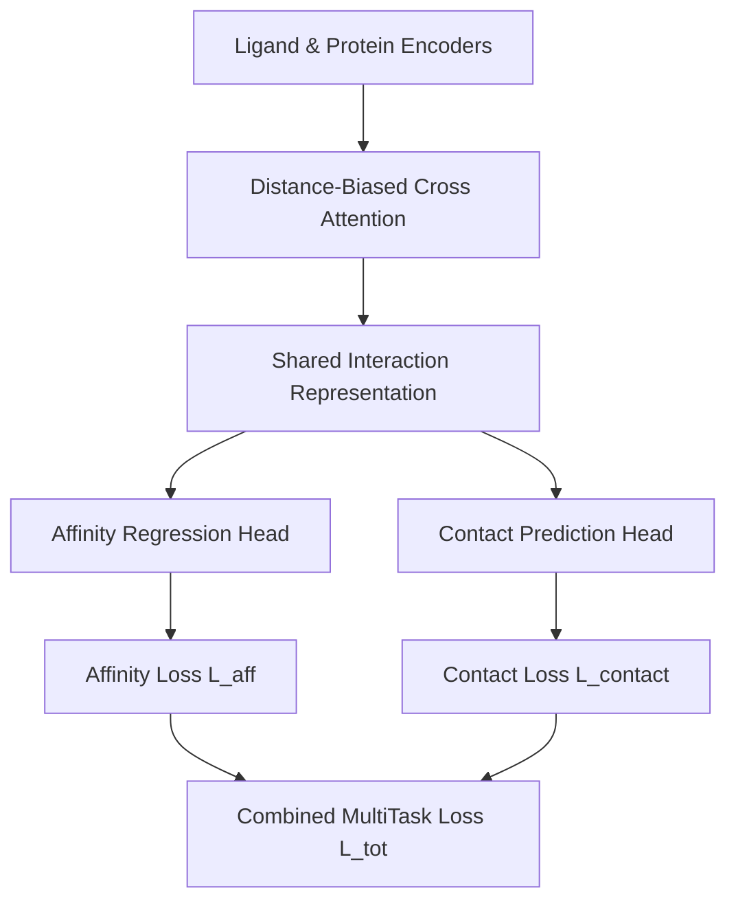

# Phase 3.2 Implementation Report
## Title: Physics-Guided Multi-Task Interaction Learning
**Date**: 2026-07-16  
**Experiment ID**: `P3.2-PHYSICS-MULTITASK`  
**Status**: Implemented & Verified  

---

### 1. Scientific Motivation & Hypothesis
The Geometry Attention mechanism (v1.3) successfully utilizes learnable distance biases to weight cross-attention, yielding a significant improvement in binding affinity prediction. However, attention scores alone do not necessarily correspond to physically meaningful inter-atomic contact maps. 
Phase 3.2 addresses this limitation by introducing **auxiliary contact supervision** over the shared interaction representations, hypothesizing that joint training will align structural attention maps with physical interaction thresholds, regularizing the latent space and improving overall affinity prediction.

---

### 2. Architecture & Multitask Topology
We maintain the certified Geometry Attention v1.3 architecture completely intact. Pairwise node embeddings before readout pooling are extracted as the shared interaction representation and fed to the multitask heads:

- **Contact Prediction Head**: Concrete subclass of the abstract `AuxiliaryHead`. Maps the broadcast pairwise concatenation of ligand node features \([L, 2D]\) and protein node features \([P, 2D]\) (concatenated shape \([L, P, 4D]\)) through a multilayer perceptron projecting to contact map logits \([L, P]\).
- **Target Generation Strategies**: Supported in `interaction_targets.py`:
  - `binary`: Binary contact map thresholded at \(d < 4.0\text{ Å}\) (default active).
  - `gaussian`: Gaussian distance labels \(e^{-\gamma d^2}\).
  - `distance_decay`: Decay ratio \(\frac{1}{1 + d^2}\).
  - `inverse_distance`: Inverse ratio \(\frac{1}{d + \epsilon}\).

- **MultiTask Loss Weighted Strategy**: Supported in `multitask_loss.py` with:
  - `fixed`: Constant weight \(\lambda = 0.1\).
  - `learnable`: Learnable parameter log-lambda.
  - `cosine`: Cosine decay schedule.
  - `linear`: Linear decay schedule.
