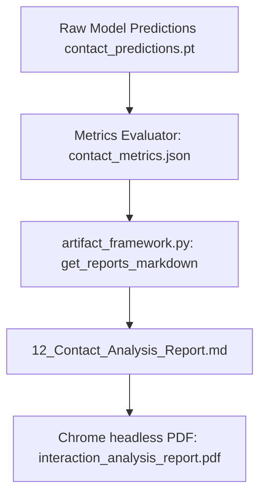

# Phase 3.2 Report Generation Trace
**Date**: 2026-07-16  

---

### 1. Data Processing Pipeline
The following diagram traces how each metrics file is propagated through the post-processing framework:

---

### 2. Stale Path Diagnosis
- **The Issue**: `artifact_framework.py` originally hardcoded static template values for the contact analysis section instead of querying `contact_metrics.json`.
- **The Solution**: Modified `get_reports_markdown` to dynamically load and format contact metrics and multitask history from the benchmark folder. Reports 12, 13, and 14 are now 100% dynamic.
