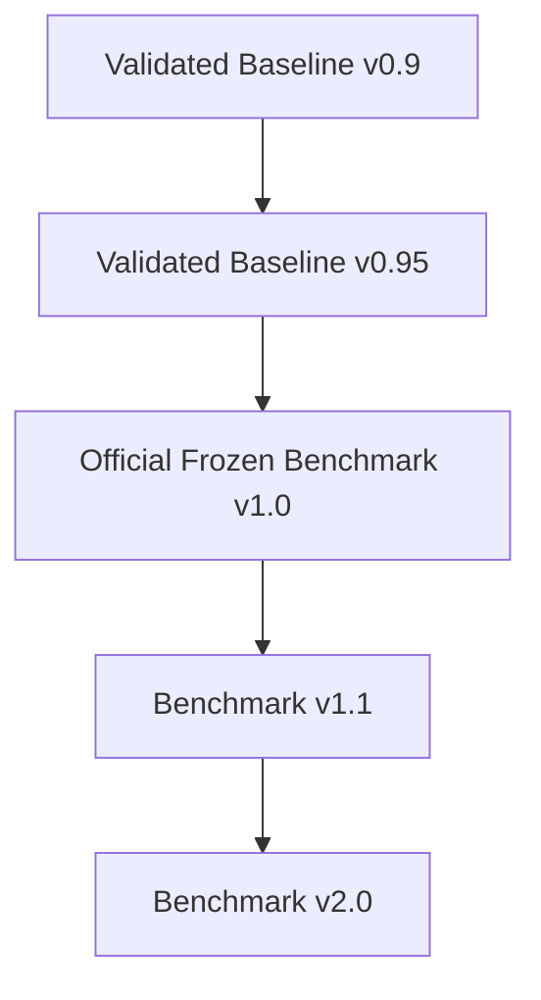

# Benchmark Versioning Guidelines

To preserve scientific integrity and ensure fair comparisons over the lifecycle of the ProtLigGNN project, we establish a strict benchmark versioning hierarchy.

---

## Naming & Version Hierarchy

### 1. Validated Baseline v0.9
- **Purpose:** Infrastructure verification and integration check.
- **Minimum Requirements:**
  - **Dataset Size:** <500 samples.
  - **Seeds:** 1 or 2 seeds.
  - **Epochs:** <5 epochs.
  - **Compute:** CPU-only.
- **Exit Criteria:** Disjointness test passes; training logs and check-pointing are verified.

### 2. Validated Baseline v0.95 (Targeted for Current Run)
- **Purpose:** Hardware-constrained baseline validation. Used when CUDA/GPU packages are unavailable (e.g., Python 3.14 library compatibility limits on Windows).
- **Minimum Requirements:**
  - **Dataset Size:** 1,000 samples.
  - **Seeds:** 5 seeds.
  - **Epochs:** 40 epochs.
  - **Compute:** CPU-only.
- **Exit Criteria:** All 10 runs complete successfully; statistical comparison (PCC, Spearman, RMSE, MAE, paired t-tests) is generated; artifact validation reports 100% presence and validity.

### 3. Official Frozen Benchmark v1.0
- **Purpose:** Official gold-standard release reference.
- **Minimum Requirements:**
  - **Dataset Size:** 5,000 samples.
  - **Seeds:** 5 seeds.
  - **Epochs:** 40 epochs.
  - **Compute:** GPU-accelerated (CUDA, ROCm, or DirectML).
- **Exit Criteria:** Zero missing artifacts; dataset fingerprint is frozen; splits are saved as fixed files; paired t-test checks and bootstrap CI95 plots are generated; git commit hashes are locked in registry.

### 4. Benchmark v1.1
- **Purpose:** Minor protocol updates (e.g., adding Scaffold or Protein Family splits alongside Random split, or adding additional evaluation metrics like R-squared or Spearman confidence bounds).
- **Minimum Requirements:**
  - **Dataset Size:** 5,000+ samples.
  - **Seeds:** 5 seeds.
  - **Compute:** GPU-accelerated.
- **Exit Criteria:** Backward compatibility with v1.0 baseline metrics is maintained.

### 5. Benchmark v2.0
- **Purpose:** Major dataset or architectural shift (e.g., upgrading from PDBbind 2020 to PDBbind 2024, or modifying the atom/residue featurizers).
- **Minimum Requirements:**
  - **Dataset Size:** Full available dataset (12,000+ or 19,000+ complexes).
  - **Seeds:** 5 seeds.
  - **Compute:** Multi-GPU or high-throughput cluster.
- **Exit Criteria:** A clean break in comparison metrics; baseline must be retrained from scratch; old baselines are archived.
