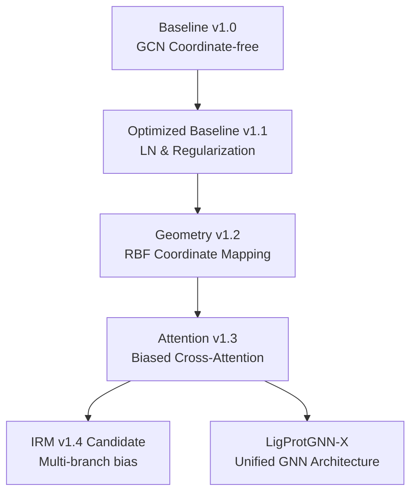
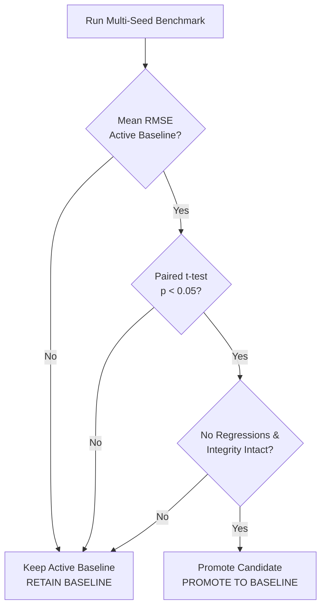

# Document 4: Complete System Architecture of the LigProtGNN Research Suite and Final LigProtGNN-X

This document details the system design, directory structures, tensor shape flow, and structural roadmaps of the **LigProtGNN Research Suite**, culminating in the unified **LigProtGNN-X** architecture.

---

## 1. Project Evolution & Version Dependencies

The development path of the suite is governed by reproducibility constraints:



---

## 2. Directory Structure & Code Layout

The project repository follows a modular, research-focused folder structure:

```
ProtLigGnn/
├── .planning/                  # Core design files & Architecture Decision Records
│   ├── adr_001_reproducibility.md
│   ├── adr_002_geometry.md
│   └── adr_003_interaction.md
├── models/                     # Model architecture files
│   ├── __init__.py
│   ├── geometry_attention/     # Baseline v1.3 components
│   │   ├── __init__.py
│   │   ├── attention_bias.py
│   │   └── geometry_attention_model.py
│   └── geometry_interaction/   # IRM Candidate v1.4 components
│       ├── __init__.py
│       ├── interfaces.py
│       ├── config.py
│       ├── interaction_utils.py
│       ├── interaction_encoder.py
│       ├── interaction_bias.py
│       └── geometry_interaction_model.py
├── tests/                      # pytest suite
│   ├── test_geometry_attention.py
│   ├── test_geometry_interaction.py
│   ├── test_pairwise_features.py
│   └── test_interaction_checkpoint.py
├── data/                       # Dataset storage
│   └── pdbbind2020/
│       ├── processed_dataset.pt # Unified graph cache file
│       └── graph_cache_manifest.json
├── experiments/                # Experiment registry and outputs
│   ├── registry.csv            # Experiment tracking file
│   └── run_xxx/
├── protliggnn_train.py         # Primary train and validation script
├── benchmark.py                # Multi-seed benchmark runner
└── experiment_infra.py         # Infrastructure and logging helpers
```

---

## 3. Data & Tensor Flow Pipeline

When a batch of complexes is fed into `ProtLigGNNGeometryInteraction`, the shapes progress through the layers as follows:

| Layer / Stage | Input Tensors | Operation | Output Tensors |
| :--- | :--- | :--- | :--- |
| **GNN Encoding** | \(X_{lig\_raw} \in \mathbb{R}^{L \times 78}\)<br>\(X_{prot\_raw} \in \mathbb{R}^{P \times 30}\) | GAT Message Passing | \(h_{lig} \in \mathbb{R}^{L \times 256}\)<br>\(h_{prot} \in \mathbb{R}^{P \times 256}\) |
| **Context Prep** | \(h_{lig}, h_{prot}, p_{lig}, p_{prot}\) | Structuring | `InteractionContext` |
| **Branch Encoding**| `InteractionContext` | parallel projection | Geometry: \(\mathbb{R}^{L \times P \times 32}\)<br>Chemistry: \(\mathbb{R}^{L \times P \times 32}\)<br>Latent: \(\mathbb{R}^{L \times P \times 32}\) |
| **Fusion Layer** | Branch tensors | Concatenate & linear | \(f_{fused} \in \mathbb{R}^{L \times P \times 32}\) |
| **Latent Mapping** | \(f_{fused}\) | Linear \(\to\) LN \(\to\) ReLU \(\to\) Drop | \(z_{interaction} \in \mathbb{R}^{L \times P \times 32}\) |
| **Logit Projector**| \(z_{interaction}\) | projection & transpose | \(\text{Bias} \in \mathbb{R}^{N_{heads} \times L \times P}\) |
| **Attention Layer**| \(h_{lig}, h_{prot}\) | softmax scaling with bias | \(z_{context} \in \mathbb{R}^{L \times 256}\) |
| **Readout & Head** | \(z_{context}\) | Mean pooling & linear MLP | \(\hat{y} \in \mathbb{R}^1\) (affinity prediction) |

---

## 4. Promotion Workflow & Repository Governance

The biostatistical validation gating workflow is implemented in `benchmark.py` and evaluated sequentially:



---

## 5. Unified LigProtGNN-X Future Roadmap

The final target architecture, **LigProtGNN-X**, integrates all planned research phases into a unified GNN framework:

```
                  +-----------------------------------+
                  |           Unified input           |
                  +-----------------+-----------------+
                                    |
            +-----------------------+-----------------------+
            |                                               |
+-----------v-----------+                       +-----------v-----------+
| Multi-Scale GNN Node  |                       |  Conformation Ensemble|
|  - atom level         |                       |  - coordinate variance|
|  - residue level      |                       |  - SE(3) invariance   |
+-----------+-----------+                       +-----------+-----------+
            |                                               |
            +-----------------------+-----------------------+
                                    |
                        +-----------v-----------+
                        |   Interaction Bias    |
                        |  - electrostatics     |
                        |  - Lennard-Jones vdW  |
                        +-----------+-----------+
                                    |
                        +-----------v-----------+
                        |   Evidential Head     |
                        |  - prediction         |
                        |  - uncertainty error  |
                        +-----------------------+
```
- **Equivariance (v2.5)**: Node coordinates are updated via coordinate-message functions, ensuring rotational and translational invariance.
- **Physical energy calculation**: Energy calculations are incorporated directly as attention logit modifiers rather than black-box embeddings.
- **Evidential Regression**: The final output head estimates the parameters of a Normal-Inverse-Gamma distribution, yielding the binding affinity alongside explicit epistemic uncertainty.
