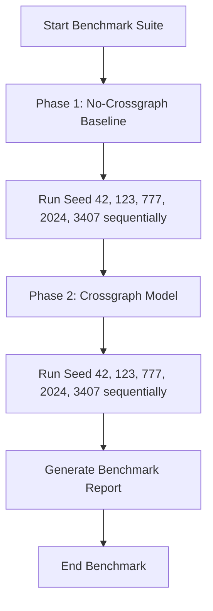

# Benchmark Execution Plan

This document outlines the step-by-step execution schedule, validation procedures, and recovery strategies for the ProtLigGNN benchmark.

## Environment & Hardware Context
- **OS:** Windows 11 (AMD64)
- **Interpreter:** Python 3.14.3
- **Acceleration Backend:** CPU ONLY (due to PyTorch `cp314` wheel package constraints on Windows)
- **Memory Footprint:** Free RAM is restricted to ~3.88 GB. Spawning multiple workers is disabled (`--num_workers 0`) to prevent OOM swapping.

## Benchmark Configuration
We will use the settings stored in [benchmark_config.yaml](file:///d:/ProtLigGnn/benchmark_config.yaml):
- **Dataset Size:** 1,000 samples (max)
- **Epochs:** 40
- **Seeds:** 5 (42, 123, 777, 2024, 3407)
- **Batch Size:** 8
- **Device:** `cpu`

---

## Training Schedule

The benchmark execution will proceed sequentially in two separate phases to prevent CPU core over-subscription and disk I/O bottlenecks.



### Phase 1: No-Crossgraph Baseline (5 Seeds)
We will launch the benchmark runner with the `--no_crossgraph` flag:
```bash
.\venv\Scripts\python benchmark.py --no_crossgraph
```
- **Estimated Runtime:** ~60 minutes (12 mins per seed).

### Phase 2: Crossgraph Model (5 Seeds)
We will launch the benchmark runner with cross-attention enabled (default):
```bash
.\venv\Scripts\python benchmark.py
```
- **Estimated Runtime:** ~60 minutes (12 mins per seed).

---

## Checkpoint & Resume Strategy

### Checkpoint Frequency
- Model weights and optimizer states will be saved to `checkpoint.pt` inside each run directory whenever the validation RMSE improves at the end of an epoch.
- A backup `last_checkpoint.pt` will also be written to allow continuous progress tracking.

### Interrupt Recovery (Resume Strategy)
If execution is interrupted (e.g., system power loss or process kill):
1. Identify the interrupted run (e.g., `experiments/run_00X`).
2. Resume the training by executing:
   ```bash
   .\venv\Scripts\python protliggnn_train.py --resume run_00X
   ```
3. Once training for that seed completes, rerun the main `benchmark.py` command with the `--allow_duplicate` flag to complete the remaining seeds.

---

## Validation & Completion Criteria

### Validation Schedule
1. **Prior to Training:** Pre-train split manifest disjointness check is executed automatically by the dataset loader.
2. **During Training:** Metric logging (RMSE, MAE, PCC, Spearman) is written at the end of every training and validation epoch to `training_history.csv`.
3. **Post-Training:** Artifact validation is executed automatically, verifying the presence and checksum of:
   - `checkpoint.pt`
   - `metrics.json`
   - `predictions.csv`
   - `config.json`
   - `environment.json`
   - `split/metadata.json`

### Benchmark Completion Criteria
The benchmark suite is considered successful and complete when:
- All 10 execution runs (5 for no-crossgraph, 5 for crossgraph) exit with code `0`.
- The experiment registry `experiments/registry.csv` is updated with 10 rows.
- A final `benchmark_report.md` is generated comparing the two configurations using paired two-sample t-tests and bootstrap 95% confidence intervals to measure statistical significance.
