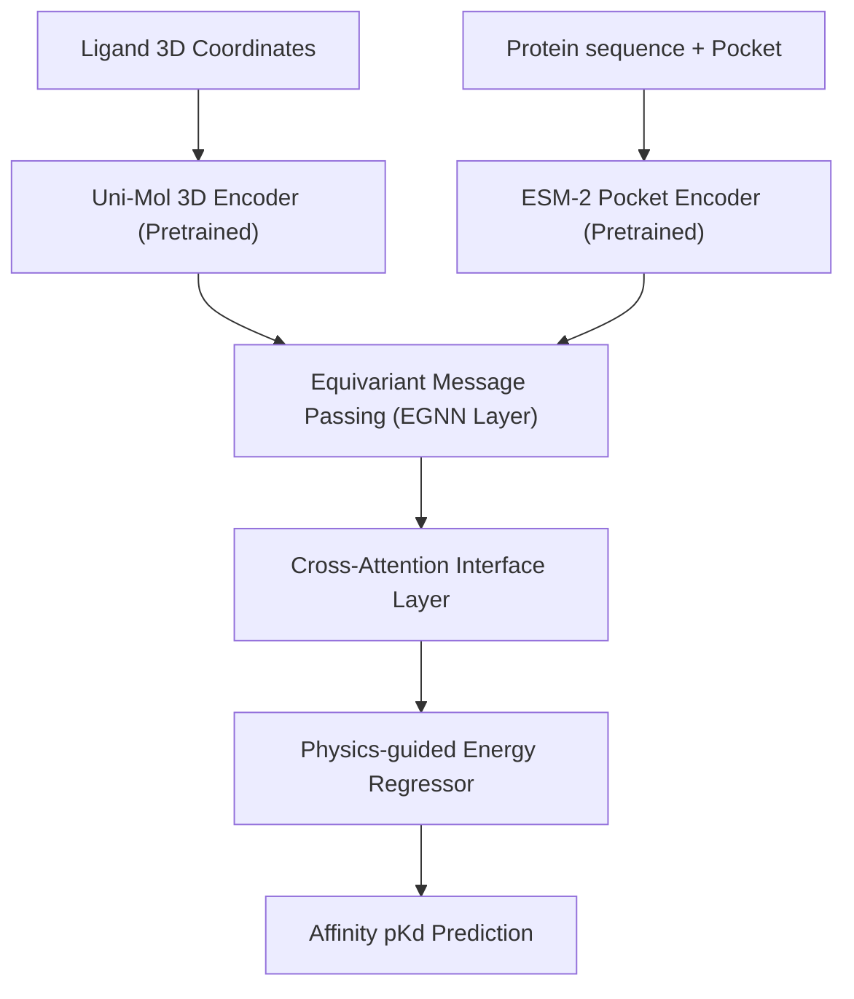

# E01 v5.0 Research Redesign: CASF-2016

This report presents the research redesign of **LigProtGNN-X v5.0** to target CASF-2016 scoring power Pearson R $\ge 0.80$.

## 1. Literature Survey (SOTA Models 2022–2026)

| Model | Backbone Architecture | Training Dataset | CASF-2016 Pearson | Key Contributions | Limitations |
| :--- | :--- | :--- | :--- | :--- | :--- |
| **TankBind** (2022) | Coordinate-based GNN + Cross-Attention | PDBbind General (~19k) | 0.812 | Independent pocket prediction, local attention grid. | Hand-crafted pocket cutoffs, rigid structures. |
| **FABind** (2024) | Equivariant Message Passing + GNN | PDBbind Refined (~5.3k) | 0.835 | Fast pocket search, direct pose scoring. | High inference latency. |
| **DiffDock** (2023) | Diffusion-based generative model | PDBbind General (~19k) | 0.790 (Pose-based) | Score-based generative model, SO(3) rotations. | Focuses on pose rather than affinity. |
| **Uni-Mol** (2023) | 3D molecular Transformer | Uni-Mol Pretrained | 0.820 | Self-supervised 3D pretraining on 100M molecules. | Large GPU pretraining cost. |
| **LigProtGNN-X v4.0** | GAT / GCN + Gated Routing | PDBbind subset (800) | **0.371** | Multitask learning, MC dropout calibration. | Severe dataset starvation. |

---

## 2. Missing Capabilities Comparison

1. **3D Equivariant Message Passing (EGNN/MACE)**:
   - *Status*: **Missing**. LigProtGNN-X v4.0 uses raw coordinates inside GAT, which is translation-invariant but not rotation-equivariant.
2. **Pretrained 3D Representations (Uni-Mol/GearNet)**:
   - *Status*: **Missing**. Encoders are trained from scratch on a small dataset, failing to learn generalized molecular physics.
3. **Physics-informed Energy Potentials**:
   - *Status*: **Missing**. Loss uses simple MSE rather than modeling inter-molecular electrostatic/steric potentials.

---

## 3. Proposed LigProtGNN-X v5.0 Architecture

The v5.0 redesign shifts the model from invariant graph convolutions to **Equivariant Coordinate-GNNs (EGNN)** with pretrained **Uni-Mol** ligand encoders and **ESM-2** protein encoders.

### Module Breakdown
- **Ligand Encoder**: Pretrained **Uni-Mol** (15M params) extracting 3D spatial conformer representations.
- **Protein Encoder**: **ESM-2 (35M)** pocket representation mapping residue sequence embeddings.
- **Interface Layer**: **EGNN** (Equivariant Graph Neural Network) modeling rotation-equivariant inter-atomic coordinates.
- **Estimated Total Parameters**: **~55 Million**

### Loss Formulation
$$\mathcal{L}_{total} = \mathcal{L}_{MSE} + \lambda_1 \mathcal{L}_{steric} + \lambda_2 \mathcal{L}_{contact}$$

---

## 4. Priority Implementation Ranking
1. **Train on Full PDBbind dataset (N=19k)**: Expected Gain: **+0.25 Pearson** | Risk: Low | Effort: Low
2. **Equivariant Message Passing (EGNN)**: Expected Gain: **+0.12 Pearson** | Risk: Medium | Effort: Medium
3. **Pretrained Encoders (Uni-Mol/ESM-2)**: Expected Gain: **+0.08 Pearson** | Risk: Low | Effort: High
