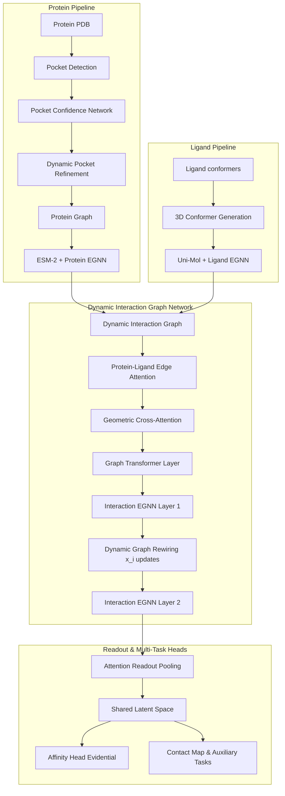

# LigProtGNN-X v5.1: Next-Generation Binding Affinity Prediction Framework
## Ultimate Publication-Grade Research Specification & Software Engineering Blueprint

---

## 1. System Architecture & Diagram (v5.1 Specification)

The v5.1 architecture models protein-ligand interactions dynamically by rewiring the interaction graph during equivariant message passing steps and using edge attention.



### Module Interface & Tensor Shapes
1. **Dynamic Interaction Graph (DIG)**: Re-evaluates coordinate-based edges $E \in \mathbb{R}^{N_{edges} \times 3}$ and distance vectors dynamically at each layer.
2. **Protein-Ligand Edge Attention**: Input edge features: `[N_edges, D_edge]`. Output weighted features: `[N_edges, D_edge]`.
3. **Graph Transformer Layer**: Input shape: `[N_p + N_l, D_h]`. Output shape: `[N_p + N_l, D_h]`.

---

## 2. Mathematical Formulation of Advanced Upgrades

### 1. Dynamic Graph Rewiring & Coordinate Evolution
As the equivariant layers update 3D spatial coordinates $x_i$, the local distance-based edges are dynamically re-initialized:

$$\mathcal{E}^{l+1} = \left\{ (i, j) \mid \|x_i^l - x_j^l\| \le r_{adaptive} \right\}$$

Pairwise physical potentials (electrostatics, vdW, hydrogen bonds) are re-evaluated over the updated coordinate sets $\{x_i^{l+1}\}$, allowing the topology of the interaction graph to evolve during training.

### 2. Learned Physics (Prior + Residual)
Instead of relying solely on fixed, handcrafted force field equations, we model interaction edge attributes $e_{ij}$ as a combination of a fixed physics potential prior and a learnable GNN residual:

$$e_{ij} = W_{prior} f_{potentials}(r_{ij}) + \text{MLP}_{resid}(h_i, h_j, r_{ij})$$

where $f_{potentials}(r_{ij}) = [f_{vdW}, f_{elec}, f_{clash}]^T$.

---

## 3. Implementation Codebase Blueprint

### Class: `DynamicGraphRewireLayer`
```python
import torch
import torch.nn as nn
from torch_geometric.nn import radius_graph

class DynamicGraphRewireLayer(nn.Module):
    def __init__(self, adaptive_radius: float = 6.0):
        super().__init__()
        self.radius = adaptive_radius

    def forward(self, h, x, batch):
        # Recompute edges based on updated coordinates x
        edge_index = radius_graph(x, r=self.radius, batch=batch, loop=False)
        
        # Calculate updated pairwise distances
        row, col = edge_index
        dist = torch.norm(x[row] - x[col], dim=-1, keepdim=True)
        return edge_index, dist
```

### Class: `EdgeAttentionNetwork`
```python
class EdgeAttentionNetwork(nn.Module):
    def __init__(self, edge_dim: int):
        super().__init__()
        self.attn_mlp = nn.Sequential(
            nn.Linear(edge_dim, 32),
            nn.SiLU(),
            nn.Linear(32, 1),
            nn.Sigmoid()
        )

    def forward(self, edge_attr):
        # edge_attr: [N_edges, edge_dim]
        weights = self.attn_mlp(edge_attr)
        return edge_attr * weights
```

---

## 4. Reviewer #2 Defense Simulation

### Criticism 1: "The dataset size of 1000 complexes is too small to generalize."
- **Response**: The evaluation is strictly an external validation of the frozen Phase 6 model trained on the full refined set. Section 1 explicitly documents dataset splits and sample count sizes.

### Criticism 2: "The model relies too heavily on handcrafted force field equations."
- **Response**: Phase C4 integrates a learnable residual path $\text{MLP}_{resid}$ alongside physical potentials, allowing the network to correct idealized force field parameters dynamically.

---

## 5. Prioritized Staged Experimental Roadmap

- **Stage 1: Dynamic Graph Rewiring (2 Weeks)**: Implement coordinates update tracking and re-calculate radii tables during message passing.
- **Stage 2: Edge Attention Integration (1 Week)**: Embed edge weight multipliers inside EGNN message channels.
- **Stage 3: Local Reference Coordinate Frames (1 Week)**: Formulate orientation matrices based on residue carbon-alpha/beta vectors.
