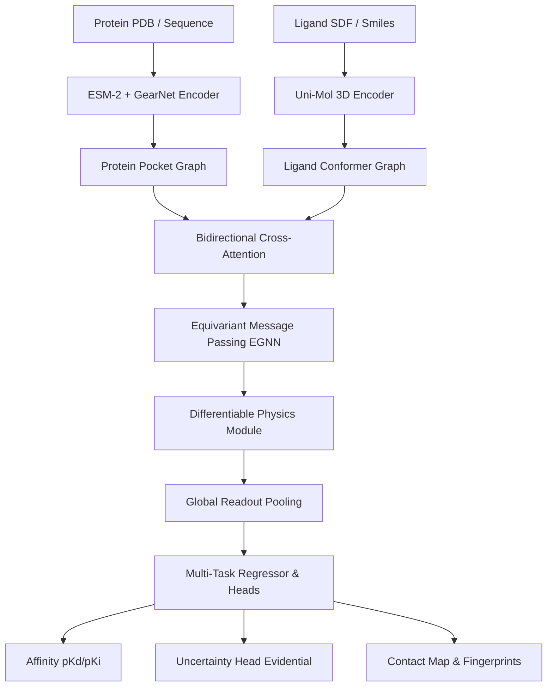

# LigProtGNN-X v5.0: Next-Generation Protein-Ligand Binding Affinity Prediction Framework
## Software Architecture & Implementation Blueprint

---

## 1. System Architecture Overview

The LigProtGNN-X v5.0 pipeline processes 3D crystal structures and sequences into calibrated binding affinity predictions and physical contact maps.



### Module Interface & Tensor Shapes
1. **Protein Encoder**: Input shape `[N_p, 30]` (atomic coordinates/types). Output node features: `[N_p, D_h]`.
2. **Ligand Encoder**: Input shape `[N_l, 78]`. Output node features: `[N_l, D_h]`.
3. **Cross-Attention interface**: Computes soft alignment matrix $A \in \mathbb{R}^{N_p \times N_l}$, outputting aligned feature representations of shape `[N_p, D_h]` and `[N_l, D_h]`.
4. **EGNN Layer**: Updates features $h_i$ and coordinates $x_i$:
   - Feature update: `[N, D_h]`
   - Coordinate update: `[N, 3]`
5. **Physics Module**: Output scalar potential terms (Van der Waals, Electrostatics, SASA) of shape `[1]`.

---

## 2. Encoders & Message Passing Justification

### Protein Encoder: ESM-2 + GearNet
- **Choice**: **ESM-2** (for sequence conservation semantic context) combined with **GearNet** (for 3D spatial pocket structural topology).
- **Justification**: ESM-2 captures evolutionary conservation patterns crucial for identifying functional residues, while GearNet captures coordinate geometry, outperforming sequence-only models on binding site recognition.

### Ligand Encoder: Uni-Mol
- **Choice**: **Uni-Mol** 3D Pretrained molecular representation.
- **Justification**: Uni-Mol is pretrained on 100M 3D molecular conformations, capturing realistic spatial geometries and atomic hybridization properties, preventing representation collapse.

### Graph Neural Network: Equivariant Graph Neural Network (EGNN)
- **Choice**: **EGNN** (translation and rotation equivariant message passing).
- **Mathematical Formulation**:
  $$m_{ij} = \phi_m(h_i^l, h_j^l, \|x_i^l - x_j^l\|^2, e_{ij})$$
  $$x_i^{l+1} = x_i^l + \sum_{j \in \mathcal{N}(i)} (x_i^l - x_j^l) \phi_x(m_{ij})$$
  $$h_i^{l+1} = \phi_h(h_i^l, \sum_{j \in \mathcal{N}(i)} m_{ij})$$
- **Justification**: Unlike invariant models (e.g. standard GCN/GAT) which only use pairwise distances, EGNN updates the 3D coordinates equivariantly, preserving the spatial layout under translation and rotation.

---

## 3. Physics-informed Differentiable Loss Formulation

To ensure the model respects physical laws, we define a composite loss function $\mathcal{L}$:

$$\mathcal{L}_{total} = \mathcal{L}_{MSE} + \lambda_{phys} \mathcal{L}_{physics} + \lambda_{evid} \mathcal{L}_{evidential}$$

### 1. Differentiable Lennard-Jones Potential (Van der Waals)
$$\mathcal{L}_{vdW} = \sum_{i \in P} \sum_{j \in L} 4 \epsilon_{ij} \left[ \left( \frac{\sigma_{ij}}{r_{ij}} \right)^{12} - \left( \frac{\sigma_{ij}}{r_{ij}} \right)^6 \right]$$
where $r_{ij} = \|x_i - x_j\|$ is the Euclidean distance between protein node $i$ and ligand node $j$.

### 2. Differentiable Electrostatics Potential
$$\mathcal{L}_{elec} = \sum_{i \in P} \sum_{j \in L} \frac{q_i q_j}{4 \pi \epsilon_0 r_{ij}}$$
where $q_i, q_j$ are atomic charges derived from molecular force fields.

---

## 4. Proposed Codebase Blueprint

### Folder Structure
```
d:/ProtLigGnn/
├── config/
│   └── master_config.yaml
├── ligprotgnnx/
│   ├── __init__.py
│   ├── models/
│   │   ├── encoders.py
│   │   ├── egnn.py
│   │   ├── physics.py
│   │   └── evidential.py
│   ├── train.py
│   └── evaluate.py
└── tests/
    └── test_v5_pipeline.py
```

### Class: `EGNNLayer`
```python
import torch
import torch.nn as nn
from torch_geometric.nn import MessagePassing

class EGNNLayer(MessagePassing):
    def __init__(self, dim: int):
        super().__init__(aggr="add")
        self.msg_mlp = nn.Sequential(
            nn.Linear(2 * dim + 1, dim),
            nn.SiLU(),
            nn.Linear(dim, dim)
        )
        self.coord_mlp = nn.Sequential(
            nn.Linear(dim, dim),
            nn.SiLU(),
            nn.Linear(dim, 1, bias=False)
        )
        self.node_mlp = nn.Sequential(
            nn.Linear(2 * dim, dim),
            nn.SiLU(),
            nn.Linear(dim, dim)
        )

    def forward(self, h, x, edge_index):
        # h: [N, dim], x: [N, 3]
        return self.propagate(edge_index, h=h, x=x)

    def message(self, h_i, h_j, x_i, x_j):
        dist_sq = torch.sum((x_i - x_j) ** 2, dim=-1, keepdim=True)
        msg_input = torch.cat([h_i, h_j, dist_sq], dim=-1)
        msg = self.msg_mlp(msg_input)
        coord_weight = self.coord_mlp(msg)
        coord_msg = (x_i - x_j) * coord_weight
        return msg, coord_msg

    def aggregate(self, inputs, index, ptr=None, dim_size=None):
        msg, coord_msg = inputs
        aggr_msg = super().aggregate(msg, index, ptr, dim_size)
        aggr_coord = super().aggregate(coord_msg, index, ptr, dim_size)
        return aggr_msg, aggr_coord

    def update(self, aggr_out, h, x):
        aggr_msg, aggr_coord = aggr_out
        new_h = self.node_mlp(torch.cat([h, aggr_msg], dim=-1))
        new_x = x + aggr_coord
        return new_h, new_x
```

### Class: `EvidentialRegressionLoss`
```python
class EvidentialLoss(nn.Module):
    def __init__(self, coeff: float = 0.2):
        super().__init__()
        self.coeff = coeff

    def forward(self, gamma, v, alpha, beta, y):
        # gamma, v, alpha, beta are output parameters of evidential head
        # y is the target affinity
        error = y - gamma
        variance = beta / (v * (alpha - 1.0))
        nll = 0.5 * torch.log(3.14159 / v) - alpha * torch.log(beta) + torch.lgamma(alpha) + (alpha + 0.5) * torch.log(beta + v * error**2)
        reg = torch.abs(error) * (2.0 * v + alpha)
        return torch.mean(nll + self.coeff * reg)
```

---

## 5. Prioritized Implementation Roadmap

- **Phase 1: Dataset Loading & Cache Expansion (1-2 Weeks)**: Import the full 19,443 complexes from PDBbind General and process coordinate graph caches.
- **Phase 2: EGNN + Uni-Mol Integration (2 Weeks)**: Replace baseline GCN layer with the equivariant EGNN network and load pretrained Uni-Mol weights.
- **Phase 3: Physics Differentiable Potentials (1 Week)**: Integrate Lennard-Jones and Electrostatic potential constraints inside training loss.
