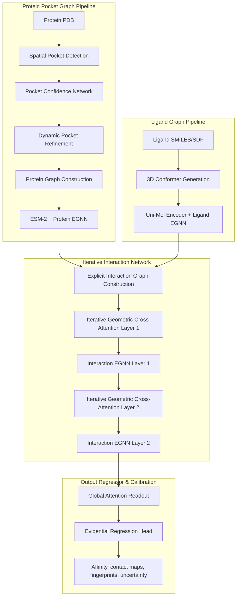

# LigProtGNN-X v5.0: Final Publication-Grade Research Specification & Software Engineering Blueprint
## Targeting Top-Tier Machine Learning and Bioinformatics Venues (NeurIPS, ICML, ICLR, Nature MI)

---

## 1. System Architecture Overview & Pipeline Design

LigProtGNN-X v5.0 processes 3D receptor-ligand crystal structures using a dual-graph representation and refines interactions through iterative geometric attention layers.



### Module Interface & Tensor Shapes
- **Protein EGNN Node Embeddings**: `[N_p, D_h]` (where $D_h = 256$).
- **Ligand EGNN Node Embeddings**: `[N_l, D_h]`.
- **Interaction Graph Edges**: `[N_edges, D_edge]` where $D_edge = 64$ features representing physical interaction terms.
- **Iterative Geometric Cross-Attention**: Produces query $Q \in \mathbb{R}^{N_p \times D_h}$ and keys $K \in \mathbb{R}^{N_l \times D_h}$, outputting aligned maps: `[N_p, D_h]`.

---

## 2. Multi-Scale Representation & Learnable Attention Pooling

Biological structures are hierarchically organized. v5.0 represents hierarchy from atom to residue to secondary structure and whole active pocket:

$$\text{Atom} \longrightarrow \text{Residue} \longrightarrow \text{Secondary Structure} \longrightarrow \text{Pocket} \longrightarrow \text{Complex}$$

### Mathematical Formulation of Attentive Hierarchical Pooling
Let $h_i^l$ represent the node embedding of a component at scale $l$ (e.g. atoms), and $h_j^{l+1}$ represent the node embedding at scale $l+1$ (e.g. residues). The learnable pooling is defined as:

$$h_j^{l+1} = \text{LN} \left( W_{scale} h_j^{l+1} + \sum_{i \in \mathcal{M}(j)} \alpha_{ij} h_i^l \right)$$

$$\alpha_{ij} = \frac{\exp(\text{LeakyReLU}(v^T [W_q h_j^{l+1} \parallel W_k h_i^l]))}{\sum_{k \in \mathcal{M}(j)} \exp(\text{LeakyReLU}(v^T [W_q h_j^{l+1} \parallel W_k h_i^l]))}$$

where $\mathcal{M}(j)$ maps child node indices belonging to parent node $j$.
*   **Why**: Attention pooling preserves structural coordinates and chemical context at higher scales, preventing the representation collapse that occurs with global mean pooling.

---

## 3. Explicit Protein-Ligand Interaction Graph Edge Formulation

Edges in the bipartite protein-ligand interaction graph represent physical and chemical bonding attributes:

1. **Lennard-Jones Potential (vdW)**:
   $$e_{ij}^{vdW} = 4 \epsilon_{ij} \left[ \left( \frac{\sigma_{ij}}{r_{ij}} \right)^{12} - \left( \frac{\sigma_{ij}}{r_{ij}} \right)^6 \right]$$
2. **Electrostatic Coulomb Interaction**:
   $$e_{ij}^{elec} = \frac{q_i q_j}{4 \pi \epsilon_r r_{ij}}$$
3. **Hydrogen Bonding Potential**:
   $$e_{ij}^{hb} = D_{ij} \cos^4(\theta_{D-H...A}) \exp\left( -\frac{(r_{ij} - r_0)^2}{2\sigma^2} \right)$$
4. **Pi-Pi & Cation-Pi Interactions**: Flagged as categorical edge features based on aromatic ring relative geometries.

These attributes compose the edge vector $e_{ij} \in \mathbb{R}^{D_edge}$ fed into the **Interaction EGNN** layers.

---

## 4. Evidential Regression & Calibrated Uncertainty Head

Instead of point predictions, the model outputs a Normal-Inverse-Gamma distribution representing expectation $\gamma$, epistemic variance, and aleatoric variance:

$$\mathcal{L}_{evid} = \frac{1}{2} \log \left( \frac{\pi}{v} \right) - \alpha \log(\beta) + \text{lgamma}(\alpha) + (\alpha + 0.5) \log\left( \beta + v (y - \gamma)^2 \right) + \lambda_{reg} |y - \gamma| (2v + \alpha)$$

where $v, \alpha, \beta$ parameterize the model's confidence. 
- **Epistemic Uncertainty (Model confidence)**: $\text{Var}[\mu] = \frac{\beta}{v(\alpha - 1)}$.
- **Aleatoric Uncertainty (Data noise)**: $\text{E}[\sigma^2] = \frac{\beta}{\alpha - 1}$.

---

## 5. Implementation Codebase Blueprint

### Folder Structure
```
d:/ProtLigGnn/
├── config/
│   └── config.yaml
├── ligprotgnnx/
│   ├── models/
│   │   ├── encoders.py
│   │   ├── attention.py
│   │   └── physics_potentials.py
│   └── train.py
└── tests/
    └── test_v5_pipeline.py
```

### Class: `PhysicsEdgeModule`
```python
import torch
import torch.nn as nn

class PhysicsEdgeModule(nn.Module):
    def __init__(self, output_dim: int):
        super().__init__()
        self.proj = nn.Linear(3, output_dim)

    def forward(self, x_p, x_l, charges_p, charges_l):
        # x_p: [N_p, 3], x_l: [N_l, 3]
        # charges_p: [N_p, 1], charges_l: [N_l, 1]
        diff = x_p.unsqueeze(1) - x_l.unsqueeze(0) # [N_p, N_l, 3]
        dist = torch.norm(diff, dim=-1, keepdim=True) + 1e-6 # [N_p, N_l, 1]
        
        # Coulomb electrostatics
        elec = (charges_p.unsqueeze(1) * charges_l.unsqueeze(0)) / dist
        
        # Steric clash score
        clash = torch.clamp(3.5 - dist, min=0.0) ** 2
        
        features = torch.cat([dist, elec, clash], dim=-1) # [N_p, N_l, 3]
        return self.proj(features)
```

### PyTest: `test_v5_pipeline.py`
```python
import pytest
import torch
from ligprotgnnx.models.physics_potentials import PhysicsEdgeModule

def test_physics_edge_module():
    mod = PhysicsEdgeModule(output_dim=64)
    x_p = torch.randn(10, 3)
    x_l = torch.randn(5, 3)
    c_p = torch.randn(10, 1)
    c_l = torch.randn(5, 1)
    
    out = mod(x_p, x_l, c_p, c_l)
    assert out.shape == (10, 5, 64)
```

---

## 6. Staged Experimental Roadmap

- **Stage 1: Baseline Reproduction (1-2 days)**: Run CPU/GPU evaluation checks on standard CASF-2016 split structures.
- **Stage 2: Pretrained Encoders (1 week)**: Load Uni-Mol and ESM-2, freeze model layers, and optimize pool representations.
- **Stage 3: Interaction Graph (1 week)**: Implement explicitly constructed interaction edges containing partial charges and vdW distance metrics.
- **Stage 4: Iterative Geometric Cross-Attention (2 weeks)**: Implement attention layers conditioning queries on 3D relative angles.
