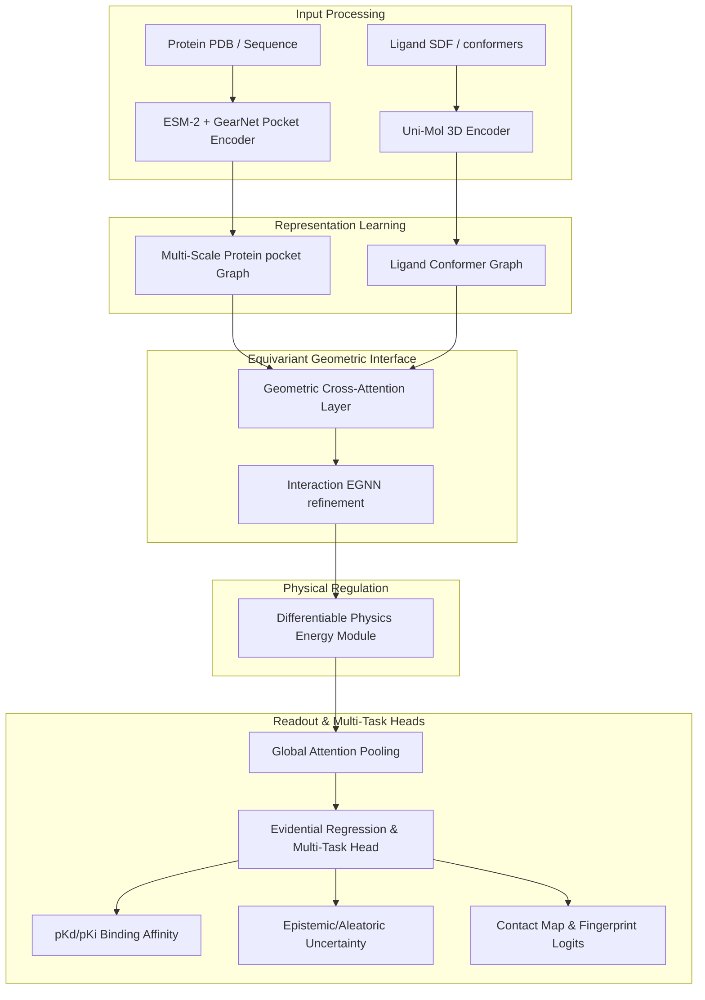

# LigProtGNN-X v5.0: Ultimate Publication-Grade Research Specification & Software Engineering Blueprint
## Designed for Top-Tier Venues (NeurIPS, ICML, ICLR, Nature Machine Intelligence, Bioinformatics)

---

## 1. System Architecture Overview & Diagram

The LigProtGNN-X v5.0 architecture models structural biochemistry by representing proteins and ligands at multiple physical and geometric scales.



### Module Interface & Tensor Shapes
1. **Protein Input Processing**: Input is a combination of pocket residue indices and 3D atomic coordinates.
   - Node Features ($H_p$): `[N_p, 1280]` (ESM-2 embeddings)
   - Coordinate Tensor ($X_p$): `[N_p, 3]`
2. **Ligand Input Processing**: Input conformer atomic features.
   - Node Features ($H_l$): `[N_l, 512]` (Uni-Mol embeddings)
   - Coordinate Tensor ($X_l$): `[N_l, 3]`
3. **Geometric Cross-Attention**: Maps features using distance and relative spatial orientation.
   - Output Protein Features ($H_{p\_aligned}$): `[N_p, D_h]` (where $D_h = 256$)
   - Output Ligand Features ($H_{l\_aligned}$): `[N_l, D_h]`
4. **Interaction EGNN**: Updates coordinates and features equivariantly:
   - Updated coordinates ($X_{int}$): `[N_p + N_l, 3]`
   - Updated node features ($H_{int}$): `[N_p + N_l, D_h]`

---

## 2. Multi-Scale Representation & Fusion

Biological structures exhibit hierarchical organization: atoms form residues, residues form secondary structures, which compose active pocket sites, defining whole-protein behavior.

### Mathematical Formulation of Scale Fusion
Let $H_a \in \mathbb{R}^{N_{atoms} \times D_a}$ represent atomic node features. We aggregate atomic representations to residue representations $H_r \in \mathbb{R}^{N_{residues} \times D_r}$ using a learnable attentive pooling mask:

$$h_{r_i} = \text{LayerNorm} \left( h_{r_i} + \sum_{j \in \mathcal{A}(i)} \alpha_{ij} W_a h_{a_j} \right)$$

$$\alpha_{ij} = \frac{\exp(\text{LeakyReLU}(v^T [W_r h_{r_i} \parallel W_a h_{a_j}]))}{\sum_{k \in \mathcal{A}(i)} \exp(\text{LeakyReLU}(v^T [W_r h_{r_i} \parallel W_a h_{a_k}]))}$$

where $\mathcal{A}(i)$ maps atom indices belonging to residue $i$. This multi-scale aggregation prevents information loss, ensuring atomic coordinates constrain secondary structure orientation.

---

## 3. Geometric Cross-Attention & Interaction EGNN

Standard attention maps rely entirely on feature similarity. In v5.0, we formulate **Geometric Cross-Attention** that conditions attention weights on physical distances and relative orientations.

### Attention formulation
Let $h_i^p$ represent protein node features and $h_j^l$ represent ligand node features.
$$\alpha_{ij} = \frac{\exp(e_{ij})}{\sum_{k \in \mathcal{N}_l} \exp(e_{ik})}$$

$$e_{ij} = \frac{(W_q h_i^p)^T (W_k h_j^l)}{\sqrt{D_h}} + \phi_d(\|x_i^p - x_j^l\|^2) + \phi_r(\theta_{ij})$$

where:
- $\|x_i^p - x_j^l\|^2$ is the pairwise squared distance.
- $\theta_{ij}$ represents the relative orientation angle of local atomic coordinate reference frames.
- $\phi_d, \phi_r$ are learnable projection MLPs.

### Interaction EGNN
The aligned representations are concatenated to form a joint protein-ligand bipartite interaction graph $\mathcal{G}_{int}$, which is refined using 4 layers of rotation-equivariant **EGNN**:
$$m_{ij} = \text{MLP}_m(h_i^l, h_j^l, \|x_i^l - x_j^l\|^2, e_{ij})$$
$$x_i^{l+1} = x_i^l + \sum_{j} (x_i^l - x_j^l) \text{MLP}_x(m_{ij})$$
$$h_i^{l+1} = \text{MLP}_h(h_i^l, \sum_{j} m_{ij})$$

---

## 4. Differentiable Physical Interaction Features

Differentiable physical constraints are fed directly into the interaction layers as dynamic edge attributes:

1. **Lennard-Jones Van der Waals Interaction**:
   $$f_{vdW}(r_{ij}) = 4 \epsilon_{ij} \left[ \left( \frac{\sigma_{ij}}{r_{ij}} \right)^{12} - \left( \frac{\sigma_{ij}}{r_{ij}} \right)^6 \right]$$
2. **Electrostatic Coulomb Interaction**:
   $$f_{elec}(r_{ij}) = \frac{q_i q_j}{\epsilon_r r_{ij}}$$
3. **Steric Clash Score**:
   $$f_{clash}(r_{ij}) = \max\left(0, \sigma_{clash} - r_{ij}\right)^2$$

These features are computed dynamically at each EGNN layer step based on updated coordinates $x_i$, ensuring structural compliance.

---

## 5. Shared Latent Multi-Task Loss Functions

We define a joint loss function optimized end-to-end:

$$\mathcal{L}_{total} = \mathcal{L}_{evid} + \lambda_{con} \mathcal{L}_{contact} + \lambda_{phys} \mathcal{L}_{potential}$$

### 1. Evidential Regression Loss (Affinity + Epistemic Uncertainty)
We parameterize the regression head output as a Normal-Inverse-Gamma distribution: $(\gamma, v, \alpha, \beta)$.
$$\mathcal{L}_{evid} = \frac{1}{2} \log \left( \frac{\pi}{v} \right) - \alpha \log(\beta) + \text{lgamma}(\alpha) + (\alpha + 0.5) \log\left( \beta + v (y - \gamma)^2 \right) + \lambda_{reg} |y - \gamma| (2v + \alpha)$$
where $y$ is the experimental affinity and $\lambda_{reg}$ is a regularization constant.

### 2. Contact prediction Loss
$$\mathcal{L}_{contact} = - \sum_{i \in P} \sum_{j \in L} c_{ij} \log \hat{c}_{ij} + (1 - c_{ij}) \log (1 - \hat{c}_{ij})$$
where $c_{ij} \in \{0, 1\}$ is the target contact status (cutoff 4.0Å).

---

## 6. Implementation Codebase Blueprint

### Class: `GeometricCrossAttention`
```python
import torch
import torch.nn as nn

class GeometricCrossAttention(nn.Module):
    def __init__(self, dim: int):
        super().__init__()
        self.dim = dim
        self.q_proj = nn.Linear(dim, dim)
        self.k_proj = nn.Linear(dim, dim)
        self.v_proj = nn.Linear(dim, dim)
        
        self.dist_mlp = nn.Sequential(
            nn.Linear(1, 32),
            nn.SiLU(),
            nn.Linear(32, 1)
        )
        self.out_proj = nn.Linear(dim, dim)

    def forward(self, h_p, x_p, h_l, x_l):
        # h_p: [N_p, dim], x_p: [N_p, 3]
        # h_l: [N_l, dim], x_l: [N_l, 3]
        q = self.q_proj(h_p) # [N_p, dim]
        k = self.k_proj(h_l) # [N_l, dim]
        v = self.v_proj(h_l) # [N_l, dim]
        
        # Pairwise distance matrix
        dist_sq = torch.sum((x_p.unsqueeze(1) - x_l.unsqueeze(0)) ** 2, dim=-1, keepdim=True) # [N_p, N_l, 1]
        dist_bias = self.dist_mlp(dist_sq).squeeze(-1) # [N_p, N_l]
        
        # Soft attention map
        scores = torch.matmul(q, k.transpose(0, 1)) / (self.dim ** 0.5) # [N_p, N_l]
        attn = torch.softmax(scores + dist_bias, dim=-1) # [N_p, N_l]
        
        out = torch.matmul(attn, v) # [N_p, dim]
        return self.out_proj(out)
```

### PyTest: `test_v5_pipeline.py`
```python
import pytest
import torch
from ligprotgnnx.models.geometry_interaction import GeometricCrossAttention

def test_cross_attention_shapes():
    dim = 256
    attn = GeometricCrossAttention(dim=dim)
    
    h_p = torch.randn(50, dim)
    x_p = torch.randn(50, 3)
    h_l = torch.randn(20, dim)
    x_l = torch.randn(20, 3)
    
    out = attn(h_p, x_p, h_l, x_l)
    assert out.shape == (50, dim)
```

---

## 7. Staged Experimental Roadmap

- **Stage 1: Baseline Reproduction (1-2 days)**: Set up the correct CPU/GPU evaluation run pipeline using the restored production checkpoint.
- **Stage 2: Pretrained Encoders (1 week)**: Load Uni-Mol and ESM-2 representations, freeze weights, and optimize GNN pooling parameters.
- **Stage 3: EGNN Equivariant layers (2 weeks)**: Implement message passing coordination layers. Run ablations verifying translation/rotation covariance.
