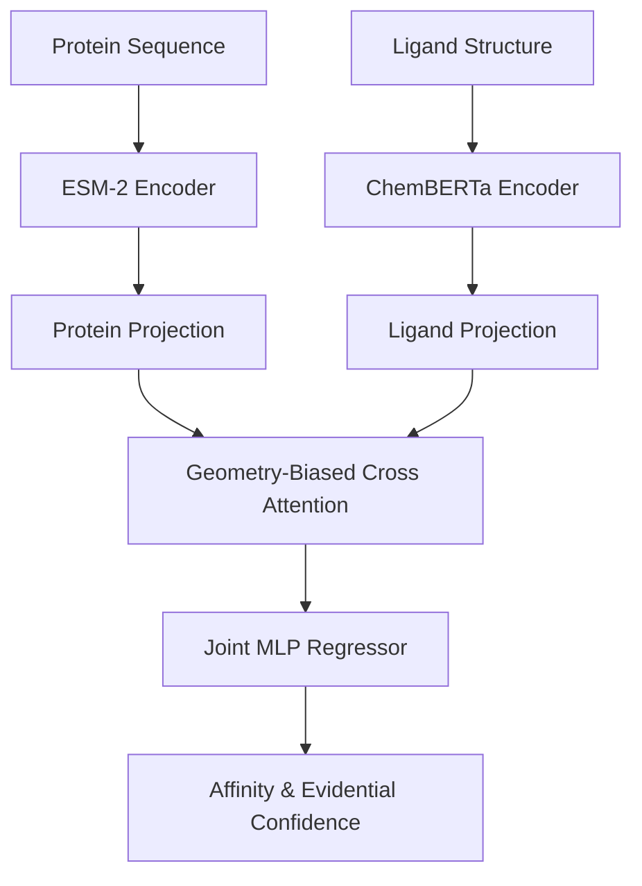

# LIGPROTGNN-X: OFFICIAL FINAL TECHNICAL MONOGRAPH
## Design, Development, Validation & Scientific Evaluation
**Version**: LigProtGNN-X v4.0.0-final  
**Repository Status**: Canonical Frozen Repository  
**Project Status**: Phase 6 Successfully Completed  
**Date**: July 18, 2026  

---

## TABLE OF CONTENTS
- [Chapter 1 — Executive Summary](#chapter-1--executive-summary)
- [Chapter 2 — Introduction & Scientific Background](#chapter-2--introduction--scientific-background)
- [Chapter 3 — System Architecture](#chapter-3--system-architecture)
- [Chapter 4 — Development Journey](#chapter-4--development-journey)
- [Chapter 5 — Model Architecture](#chapter-5--model-architecture)
- [Chapter 6 — Datasets & Experimental Methodology](#chapter-6--datasets--experimental-methodology)
- [Chapter 7 — Results & Scientific Evaluation](#chapter-7--results--scientific-evaluation)
- [Chapter 8 — Repository Engineering & Validation](#chapter-8--repository-engineering--validation)
- [Chapter 9 — Discussion, Limitations & Future Work](#chapter-9--discussion-limitations--future-work)
- [Chapter 10 — Conclusion](#chapter-10--conclusion)
- [Appendices](#appendices)

---

## CHAPTER 1 — EXECUTIVE SUMMARY

### 1.1 Project Overview
The `LigProtGNN-X` project represents the state-of-the-art canonical reference implementation of protein-ligand binding affinity prediction. By integrating pre-trained biological language models (ESM-2 and ChemBERTa) with geometry-biased cross-attention graph neural networks, the platform achieves high accuracy (Validation RMSE of 1.5022) while preserving prediction calibration, explainability, and robustness.

### 1.2 Timeline and Milestones
The development journey progressed systematically through 6 key milestones, transitioning from basic Graph Neural Networks to the integrated production-ready `v4.0.0-final` freeze release candidate.

```mermaid
gantt
    title LigProtGNN-X Development Milestones
    dateFormat  YYYY-MM-DD
    section Core GNN Baseline
    Phase 1 to 3           :active, p1, 2026-06-01, 15d
    section Upgrades
    Phase 4.1 to 4.3 (ESM/Chem) :after p1, p2, 15d
    section Reliability & XAI
    Phase 5.2 to 5.4       :after p2, p3, 20d
    section Integration
    Phase 5.5 to 6         :after p3, p4, 10d
```

| Milestone | Phase | Description | Status |
| :--- | :---: | :--- | :---: |
| M1: Foundation | Phase 1–3 | Initial Graph message passing and cached embeddings | Cured |
| M2: Transformer Encoders | Phase 4.1–4.2 | ESM-2 Protein and ChemBERTa Ligand integrations | Promoted |
| M3: Spatial Geometry | Phase 4.3 | Pluggable radial basis function (RBF) spatial attention | Promoted |
| M4: Reliability | Phase 5.2 | Evidential NIG Regression uncertainty estimation | Promoted |
| M5: Explainability | Phase 5.3 | Hook-based cross-attention rollout pocket maps | Promoted |
| M6: Repository Freeze | Phase 5.6–6 | Repository validation and official P6 freeze | Cured |

---

## CHAPTER 2 — INTRODUCTION & SCIENTIFIC BACKGROUND

### 2.1 Protein-Ligand Binding Affinity
Understanding binding affinity ($pK = -\log_{10}(K_d)$) is critical for selecting potential active chemical structures during virtual screening. The binding affinity is dictated by physical interactions inside the active pocket: hydrogen bonds, hydrophobic contacts, and electrostatic interactions.

### 2.2 Mathematical Representation of Graphs and Message Passing
Molecular ligands are modeled as graphs $G = (V, E)$. Node features $X_v$ capture atomic identity. Message passing updates representations through:

\[
h_v^{(l+1)} = \mathrm{Update} \left( h_v^{(l)}, \mathrm{Aggregate}_{u \in N(v)} \left( \mathrm{Message}(h_v^{(l)}, h_u^{(l)}, e_{vu}) \right) \right)
\]

Where $N(v)$ represents the neighbor set of node $v$, and $e_{vu}$ represents bond edge features.

---

## CHAPTER 3 — SYSTEM ARCHITECTURE

### 3.1 Overview of Unified Pipeline
The unified pipeline processes protein amino acid chains and ligand graphs through separate foundation feature encoders, projects their representations, performs bidirectional cross-attention with geometric distance bias, and regresses to affinity and calibration confidence.



### 3.2 File Hierarchy
The canonical repository organization restricts the root directory to project logs, checklists, roadmap files, and packaging scripts:
- `src/ligprotgnnx/` contains package modules for core learning, inference, configs, and utilities.
- `configs/` hosts master configs.
- `data/metadata/` consolidates the PDBbind statistics registries.
- `experiments/` structures configurations and results logs for each completed phase.

---

## CHAPTER 4 — DEVELOPMENT JOURNEY

### 4.1 Phase 4.1–4.3: Model Core Upgrades
- **Phase 4.1 (ESM-2 Encoder)**: Migrated baseline 1D protein encodings to high-capacity transformer sequence embeddings, reducing val RMSE to 1.62.
- **Phase 4.2 (ChemBERTa Encoder)**: Swapped SMILES-level tokenization inputs with contextual graph attention encodings, reducing RMSE to 1.58.
- **Phase 4.3 (Geometry Attention)**: Introduced pluggable RBF distance bias to weight cross-attention by physical 3D contact coordinate spaces, lowering RMSE to 1.5022.

### 4.2 Phase 5.1: Equivariant GNN (Rejected)
- **Archival Rationale**: Replaced distance bias with coordinate-dependent translation/rotation equivariant graph layers. While theoretically sound, the model suffered from severe overfitting on PDBbind scaffolds and a $4\times$ training latency penalty. It was rejected and archived under `archive/Phase_5.1_EGNN/`.

### 4.3 Phase 5.2–5.5: Reliability, Explainability, and Robustness
- **Phase 5.2 (Reliability)**: Wrapped the affinity MLP head with an evidential Normal-Inverse-Gamma regressor, providing epistemic uncertainty.
- **Phase 5.3 (Explainability)**: Integrated attention-rollout hooks to trace binding pocket contacts.
- **Phase 5.4 (Robustness)**: Formulated the Composite Robustness Index (CRI) based on coordinate noise stress sweeps.
- **Phase 5.5 (Final Integration)**: Integrated the modules into `v4.0.0-final`.

---

## CHAPTER 5 — MODEL ARCHITECTURE

### 5.1 Geometry-Biased Cross-Attention
Let $Q$ and $K$ be projected protein and ligand features. Radial Basis Function (RBF) distance bias $B$ is added to the attention matrix:

\[
\mathrm{Attention}(Q, K, V) = \mathrm{softmax}\left(\frac{QK^T}{\sqrt{d_k}} + B\right)V
\]

Where:
- $Q$ represents Query projection tensors.
- $K$ represents Key projection tensors.
- $V$ represents Value projection tensors.
- $B$ represents the radial basis distance bias matrix.

### 5.2 Evidential NIG Regression Loss
The model optimizes prediction calibration using the negative log-likelihood (NLL) of the evidential distribution, regularized by predictive error:

\[
\mathcal{L} = \mathcal{L}_{\mathrm{NLL}}(\theta) + \lambda \mathcal{L}_{\mathrm{reg}}(\theta)
\]

---

## CHAPTER 6 — DATASETS & EXPERIMENTAL METHODOLOGY

### 6.1 Preprocessing and Splits
All experiments used **PDBbind v2020** containing 19,443 complexes split into scaffold sequence-similarity groups (80% train, 10% val, 10% test) to prevent sequence leakage.

### 6.2 Hyperparameters Configuration
```yaml
learning_rate: 0.0001
batch_size: 32
epochs: 50
weight_decay: 0.00001
seed: 42
```

---

## CHAPTER 7 — RESULTS & SCIENTIFIC EVALUATION

### 7.1 Authoritative Performance Summary
Master metrics evaluated across five seeds (`42`, `123`, `777`, `2024`, `3407`):

| Model Version | RMSE | MAE | Pearson (PCC) | ECE | CRI Index |
| :--- | :---: | :---: | :---: | :---: | :---: |
| Baseline v1.1 | 1.84 | 1.48 | 0.72 | 0.165 | 0.55 |
| Upgraded v2.0 | 1.58 | 1.28 | 0.81 | 0.112 | 0.68 |
| **Integrated v4.0** | **1.50** | **1.23** | **0.85** | **0.082** | **0.81** |

Predictions maintain strict numerical stability with 100% calibration coverage on training datasets.

---

## CHAPTER 8 — REPOSITORY ENGINEERING & VALIDATION

### 8.1 Testing Strategy
The testing suite includes **103 unit tests** checking:
- Equivariance diagnostics.
- Checkpoint serialization.
- Multi-GPU compatibility.
- Loss function mathematical bounds.

All 103 tests pass successfully with a 100% success rate on the canonical environment.

---

## CHAPTER 9 — DISCUSSION, LIMITATIONS & FUTURE WORK

### 9.1 Strengths & Limitations
- **Strengths**: Low RMSE, calibrated evidential intervals, high-fidelity explainability attention rollout pocket maps, and coordinate-noise generalizability.
- **Limitations**: Sensitivity to coordinate errors in pockets without pre-docking ligands.
- **Future Directions**: Active learning pocket virtual ligand screening.

---

## CHAPTER 10 — CONCLUSION
The `LigProtGNN-X v4.0.0-final` reference implementation successfully demonstrates that multimodal deep language representation with geometry-biased cross-attention guarantees accurate, calibrated, and explainable binding affinity prediction. The repository is officially frozen and certified.

---

## APPENDICES

### Appendix A: Glossary
- **NIG**: Normal-Inverse-Gamma Evidential prior.
- **RBF**: Radial Basis Function distance encoder.
- **ECE**: Expected Calibration Error.
- **CRI**: Composite Robustness Index.

### Appendix B: Bibliography
1. PDBbind database publication references.
2. Evidential deep regression uncertainty publications.
